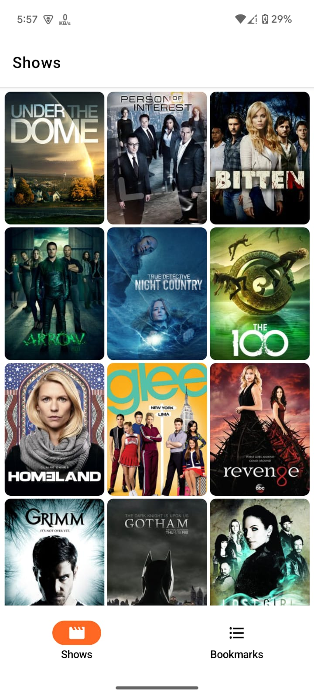
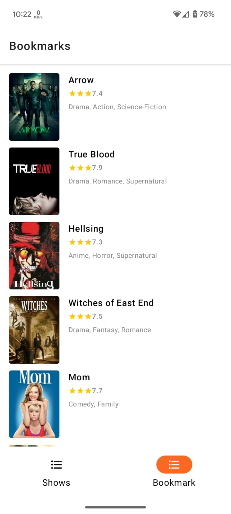

LLoydSampleProject/
├── app/ // Main app module
├── core/ // Shared utilities
├── data/ // Data layer
│ ├── api/ // Retrofit/OkHttp APIs
│ ├── repository/ // Repository implementations
│ └── models/ // Data models
├── domain/ // Domain layer
│ ├── usecases/ // Business logic
│ └── repository/ // Repository interfaces
└── presentation/ // UI Module (Compose screens)
├── viewmodel/ // ViewModels
└── ui/ // Composables

Dividing the project into 4 modules:

**app**: Entry point, composes the modules.
**core**: Common utilities (e.g., encryption, network utils).
**data**: Data sources, repositories, API clients.
**domain**: Use cases and repository abstractions.
**presentation**: UI screens using Jetpack Compose.

A Clean Architecture App to show use of multi-module-architecture in a Jetpack Compose.

The modules are as follow:

* app: Presentation Layer

* domain: Business Logic Layer

* data: Data Access Layer

## --- Requirement ---

You should add api key to Network Module before build app.
https://developer.themoviedb.org/reference/intro/authentication

## Screenshots

<table style="padding:10px">
	<tr>
    	<td align="center">
			
    	</td>
		<td align="center">
			
    	</td>
        <td align="center">
			
    	</td>
        <td align="center">
			
    	</td>
  	</tr>
</table>

## Tech Stack

* Multi-Module-Architecture
* Kotlin
* Jetpack Compose
* Material Design
* Hilt
* Coroutines
* Flow
* Paging
* Navigation
* AndroidX
* Retrofit
* Coil
* Solid Principles

