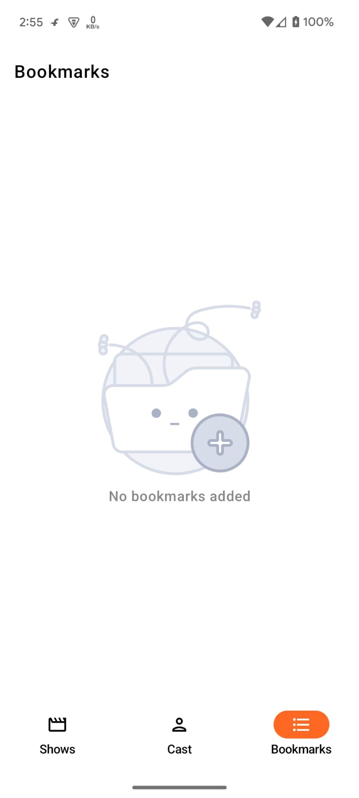

## Project Structure

| **Module/Directory**  | **Description**                                |
|-----------------------|------------------------------------------------|
| `LLoydSampleProject/` | Root directory of the project.                 |
| `app/`                | Main application module.                       |
| `data/`               | Data layer for the project.                    |
| ├── `api/`            | Contains Retrofit/OkHttp API definitions.      |
| ├── `repository/`     | Repository implementations for data sources.   |
| └── `models/`         | Data models representing the API and database. |
| `domain/`             | Domain layer encapsulating business logic.     |
| ├── `usecases/`       | Contains use case implementations.             |
| └── `repository/`     | Interfaces for repository abstractions.        |
| `presentation/`       | UI module housing all Jetpack Compose screens. |
| ├── `viewmodel/`      | Contains ViewModels for UI logic.              |
| └── `ui/`             | Composable functions for the UI layer.         |

Dividing the project into 3 modules:

**app/presentation**: Entry point, composes the modules,UI screens using Jetpack Compose..
**data**: Data sources, repositories, API clients.
**domain**: Use cases and repository abstractions.

A Clean Architecture App to show use of multi-module-architecture in a Jetpack Compose.

The modules are as follow:

* app: Presentation Layer

* domain: Business Logic Layer

* data: Data Access Layer

## Screenshots

<table style="padding:10px">
	<tr>
    	<td align="center">
			
    	</td>
		<td align="center">
			
    	</td>
		<td align="center">
			
    	</td>
        <td align="center">
			
    	</td>
        <td align="center">
			
    	</td>
  	</tr>
</table>

## Video

<table style="padding:10px">
	<tr>
    	<td align="center">
			
    	</td>
  	</tr>
</table>

## Tech Stack
* [Multi-Module-Architecture](https://developer.android.com/topic/modularization) - Guide to Android app modularization
* [Kotlin](https://kotlinlang.org/) 
* [Jetpack Compose](https://developer.android.com/compose) -  UI Implementation
* [Material Design](https://developer.android.com/develop/ui/views/theming/look-and-feel) - For visual, motion, and interaction design across devices
* [Hilt](https://developer.android.com/training/dependency-injection/hilt-android) - Dependency Injection
* [Coroutines](https://kotlinlang.org/docs/coroutines-overview.html) - Asynchronous or non-blocking programming
* [Flows](https://developer.android.com/kotlin/flow) -
* [Navigation-Jetpack](https://developer.android.com/jetpack/androidx/releases/navigation) - Navigating between 'destinations' within an Android application
* [AndroidX](https://developer.android.com/jetpack/androidx) - 
* [Retrofit](https://square.github.io/retrofit/) -  API Calls
* [Solid Principles](https://medium.com/the-android-caf%C3%A9/solid-principles-the-kotlin-way-ff717c0d60da)

