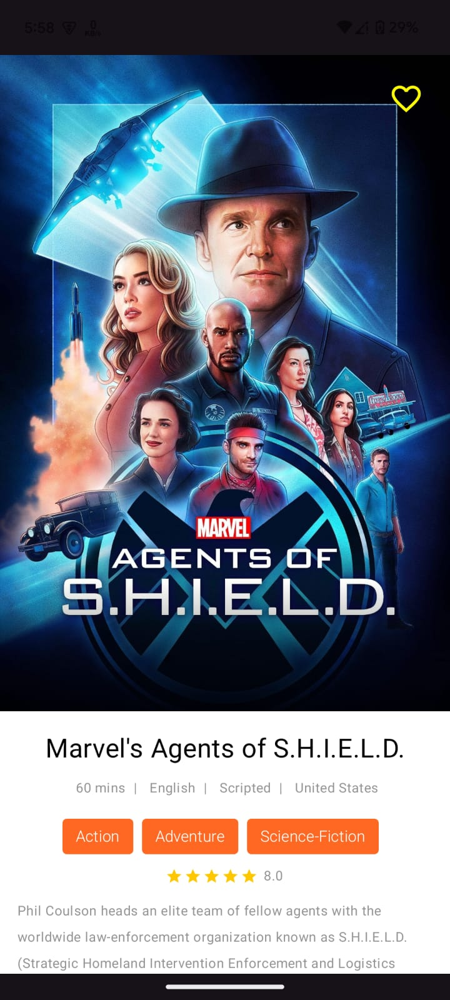

## My Tv Shows App

Welcome to My Tv Shows App! 🎬📺 This app is your ultimate companion for discovering, bookmarking, and
exploring your favorite Tv shows and their cast members.

📱 Features

1. Tv Shows Tab

   * Browse Popular Tv Shows: Discover a curated list of popular TV shows, updated regularly.
   * Detailed Information: Tap on a show to explore its synopsis, ratings, and more.
   * Bookmark Your Favorites: Easily bookmark or unbookmark your preferred shows to keep track of them.

2. Cast Tab

   * Discover the Cast: Explore the cast members of various TV shows, all in one place.
   * Cast Details: View detailed profiles, including names, profile photos, and their locations.

3. Bookmarks Tab

   * Your Favorites in One Place: Access all your bookmarked TV shows from a single tab.
   * Revisit & Manage: Quickly revisit your favorites or update your bookmarked list with ease.

4. Search Functionality

   * Find Any TV Show: Use the search bar to find specific TV shows by title.
   * Explore Details: View detailed information about the shows you're interested in.
   * Bookmark Seamlessly: Add shows to your bookmarks directly from the search results.

## Project Structure

| **Module/Directory**  | **Description**                                |
|-----------------------|------------------------------------------------|
| `LLoydSampleProject/` | Root directory of the project.                 |
| `data/`               | Data layer for the project.                    |
| ├── `api/`            | Contains Retrofit/OkHttp API definitions.      |
| ├── `repository/`     | Repository implementations for data sources.   |
| └── `models/`         | Data models representing the API and database. |
| `domain/`             | Domain layer encapsulating business logic.     |
| ├── `usecases/`       | Contains use case implementations.             |
| └── `repository/`     | Interfaces for repository abstractions.        |
| `app/presentation/`   | UI module housing all Jetpack Compose screens. |
| ├── `viewmodel/`      | Contains ViewModels for UI logic.              |
| └── `ui/`             | Composable functions for the UI layer.         |

Dividing the project into 3 modules:

**app/presentation**: Entry point, composes the modules,UI screens using Jetpack Compose..
**data**: Data sources, repositories, API clients.
**domain**: Use cases and repository abstractions.

A Clean Architecture App to show use of multi-module-architecture in a Jetpack Compose.

The modules are as follow:

* app: Presentation Layer

* domain: Business Logic Layer

* data: Data Access Layer

## Screenshots

1. TvShows Screen

<table style="padding:10px">
    <tr>
    	<td align="center">
			
    	</td>
        <td align="center">
			
    	</td>
    </tr>
</table>

2. Casts Screen

<table style="padding:10px">
    <tr>
    	<td align="center">
			
    	</td>
        <td align="center">
			
    	</td>
    </tr>
</table>

3. Bookmarks Screen

<table style="padding:10px">
	<tr>
        <td align="center">
			
    	</td>
        <td align="center">
			
    	</td>
  	</tr>
</table>

4. Search Screen

<table style="padding:10px">
	<tr>
        <td align="center">
			
    	</td>
        <td align="center">
			
    	</td>
        <td align="center">
			
    	</td>
  	</tr>
</table>

5. Connection Error and Drag to refresh

<table style="padding:10px">
    <tr>
    	<td align="center">
			
    	</td>
        <td align="center">
			
    	</td>
        <td align="center">
			
    	</td>
        <td align="center">
			
    	</td>
    </tr>
</table>

## Video

<table style="padding:10px">
	<tr>
    	<td align="center">
			
    	</td>
  	</tr>
</table>

## Tech Stack

* [Multi-Module-Architecture](https://developer.android.com/topic/modularization) - A guide to
  Android app modularization, enabling better scalability, faster builds, and maintainability.
* [Kotlin](https://kotlinlang.org/) - The primary programming language for Android development,
  known for its concise syntax, safety, and interoperability with Java.
* [Jetpack Compose](https://developer.android.com/compose) - A modern UI toolkit for building native
  Android interfaces with a declarative approach.
* [Material Design](https://developer.android.com/develop/ui/views/theming/look-and-feel) -
  Implements Google's design principles for visual, motion, and interaction design across devices.
* [Hilt](https://developer.android.com/training/dependency-injection/hilt-android) - A dependency
  injection framework that simplifies managing dependencies and lifecycle-aware components in
  Android apps.
* [Coroutines](https://kotlinlang.org/docs/coroutines-overview.html) - Enables asynchronous
  programming with simplified thread management and non-blocking code.
* [Flows](https://developer.android.com/kotlin/flow) - A reactive stream API for managing
  asynchronous data and handling UI state changes efficiently.
* [Navigation-Jetpack](https://developer.android.com/jetpack/androidx/releases/navigation) -
  Simplifies app navigation between destinations, supporting deep linking and arguments.
* [AndroidX](https://developer.android.com/jetpack/androidx) - Backward-compatible libraries that
  ensure modern Android app development with additional features and updates.
* [Retrofit](https://square.github.io/retrofit/) - A type-safe HTTP client for handling RESTful API
  requests with ease and efficiency.
* [Solid Principles](https://medium.com/the-android-caf%C3%A9/solid-principles-the-kotlin-way-ff717c0d60da) -
  Ensures scalable and maintainable code by adhering to object-oriented design principles.

